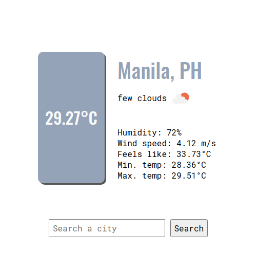

# Weather App

A weather forecast site using JavaScript, HTML and CSS. Users can search a city and check the weather forecast (clouds, temperature, humidity, and wind speed) according the the OpenWeather API.

See live demo [here](https://letsgo12300.github.io/weather-app/).

## Built With
* [Webpack](https://webpack.js.org/)
* [OpenWeather API](https://openweathermap.org/)